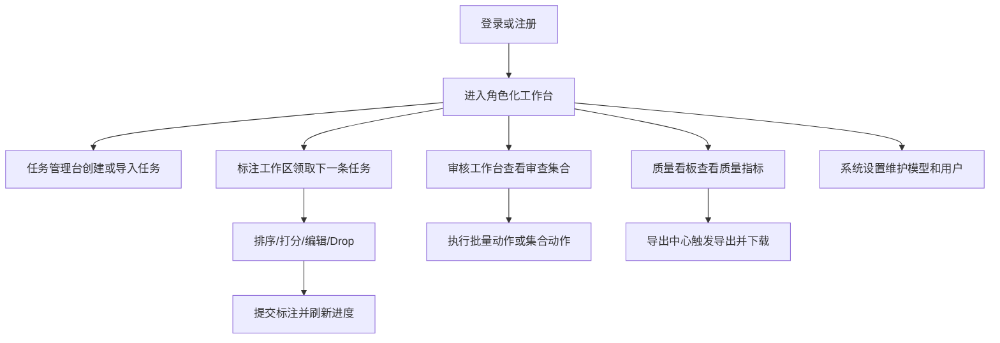

## 1. 产品概述
偏好数据标注工作台前端用于承接现有 FastAPI 后端能力，提供从任务创建、标注、审核、看板到导出的完整 Web 工作流。
- 面向标注者、审核者、训练工程师和管理员，目标是把后端接口转化为可直接演示和使用的桌面端工作台
- 通过高效率交互、清晰的数据反馈和低认知负担的操作流程，提升偏好数据生产质量和管理效率

## 2. 核心功能

### 2.1 用户角色
| 角色 | 注册方式 | 核心权限 |
|------|----------|----------|
| 标注者 | 邮箱注册/登录 | 创建任务、进入队列、提交标注、查看个人进度 |
| 审核者 | 管理员分配角色 | 查看审查集合、批量审核、查看审查日志 |
| 训练工程师 | 管理员分配角色 | 查看质量看板、触发导出、下载导出作业 |
| 管理员 | 邮箱注册后维护角色 | 用户管理、模型配置、任务批量导入、全局查看 |

### 2.2 功能模块
1. **登录与身份入口**：登录、注册、角色感知跳转、个人信息展示
2. **任务管理台**：新建任务、批量导入、任务列表、状态筛选、Kappa/计数摘要
3. **标注工作区**：队列领取、响应排序、打分、编辑、并列、Drop、历史回看、进度
4. **审核工作台**：低 Kappa、低区分度、异常标注者、批量动作、集合动作、日志
5. **质量看板**：健康度总览、Kappa 分布、类别分布、区分度分布、标注者行为
6. **导出中心**：导出表单、导出作业列表、下载和删除
7. **系统设置**：模型配置 CRUD、用户角色管理

### 2.3 页面明细
| 页面名称 | 模块名称 | 功能描述 |
|-----------|-------------|---------------------|
| 登录页 | 登录表单 | 邮箱密码登录，成功后根据角色进入工作台 |
| 登录页 | 注册入口 | 新用户创建账号，可填写名称 |
| 总览页 | 角色导航 | 根据当前用户角色展示可访问模块 |
| 任务管理台 | 新建任务弹窗 | 输入 Prompt、分类、选择至少两个模型并创建任务 |
| 任务管理台 | 批量导入 | 粘贴或编辑多条 Prompt，批量调用 `/api/tasks/import` |
| 任务管理台 | 任务列表 | 展示 Prompt 摘要、状态、响应数、标注数、Kappa、分类 |
| 标注工作区 | 当前任务区 | 显示 Prompt、状态、分类、计时信息 |
| 标注工作区 | 响应排序区 | 拖拽排序、打分、编辑、恢复原文、并列提示 |
| 标注工作区 | 导航区 | 下一条、历史回看、个人进度、Drop 动作 |
| 审核工作台 | 审查集合面板 | 展示低 Kappa、needs rework、低区分度、慢任务、异常标注者等集合 |
| 审核工作台 | 集合动作条 | 调用批量动作、apply-set-action、dry-run 预览 |
| 审核工作台 | 审查日志 | 查看 review events 历史 |
| 质量看板 | 概览卡片 | 总任务数、完成数、Drop 率、平均耗时、可用数据比例 |
| 质量看板 | 图表区 | Kappa 柱图、类别分布、相似度分布 |
| 质量看板 | 标注者分析表 | 平均时长、Drop 率、位置偏差、与他人一致性 |
| 导出中心 | 导出表单 | 设置格式、文件类型、阈值、是否使用 edits、tie 策略 |
| 导出中心 | 作业列表 | 列出导出作业、状态、下载链接、删除按钮 |
| 系统设置 | 模型配置 | 管理模型配置、新增/编辑/启用/禁用 |
| 系统设置 | 用户管理 | 管理用户名称和角色 |

## 3. 核心流程
- 未登录用户先完成注册或登录，进入主工作台
- 标注者从任务管理台创建任务，或直接进入标注工作区从队列获取下一条任务
- 标注者对响应进行拖拽排序、打分、编辑或 Drop，提交后进入下一条任务
- 审核者在审核工作台查看审查集合，对命中任务执行批量审核动作并记录日志
- 训练工程师在看板查看质量概览后前往导出中心生成训练数据
- 管理员维护模型配置、用户角色，并可通过任务管理台进行批量导入

## 4. 用户界面设计
### 4.1 设计风格
- 主色与辅色：深石墨黑、雾银灰、酸性青绿、少量琥珀高亮，整体采用偏编辑台和实验室气质的深色方案
- 按钮风格：大圆角矩形与细描边结合，主按钮高对比荧光描边，危险动作采用暖红强调
- 字体与字号：标题使用有机械感的展示字体，正文使用高可读无衬线字体，表格和数值使用等宽字体
- 布局风格：桌面优先，左侧侧栏 + 顶部上下文条 + 主内容双列/栅格混排
- 图标风格：线性图标配合少量状态色点缀，避免娱乐化 emoji

### 4.2 页面设计概览
| 页面名称 | 模块名称 | UI 元素 |
|-----------|-------------|-------------|
| 登录页 | 登录卡片 | 居中悬浮卡片、网格背景、渐变边框、轻微浮动动画 |
| 总览页 | 角色导航 | 左侧固定导航、角色徽章、顶部当前用户信息 |
| 任务管理台 | 列表区 | 高密度数据表格、筛选工具条、状态胶囊、抽屉式详情 |
| 标注工作区 | 响应卡片 | 支持拖拽手柄、星级评分、内联编辑框、响应来源标签 |
| 审核工作台 | 集合面板 | 标签页切换、卡片列表、操作浮条、日志时间线 |
| 质量看板 | 图表区 | 强对比数字卡片、半透明图表容器、状态分段色带 |
| 导出中心 | 作业区 | 左侧表单、右侧作业列表、下载状态反馈 |
| 系统设置 | 管理表格 | 可编辑表单弹窗、简洁表格、权限状态标记 |

### 4.3 响应式
- 采用桌面优先设计，优先覆盖 1280px 以上宽屏工作台体验
- 平板端保留核心使用能力，导航折叠为顶部抽屉
- 移动端只保证基础浏览和轻量管理，不优先优化复杂拖拽标注流程

