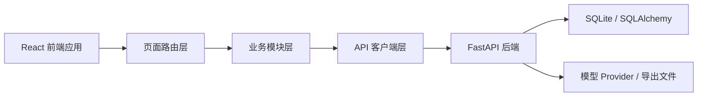
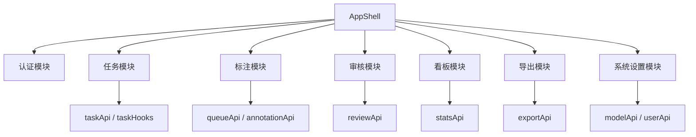
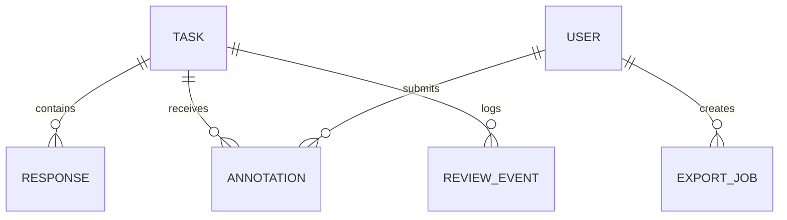

## 1. 架构设计


## 2. 技术说明
- 前端：React 18 + TypeScript + Vite
- 样式：Tailwind CSS 3 + CSS Variables + 少量自定义动画
- 状态管理：React Query 管理服务端状态，Zustand 管理局部 UI 状态
- 路由：React Router
- 表单：React Hook Form
- 拖拽：dnd-kit
- 图表：Recharts
- 表格：TanStack Table
- 通知：轻量 toast 组件
- 初始化工具：Vite
- 后端：现有 FastAPI，无需新增服务
- 数据源：直接使用现有 REST API

## 3. 路由定义
| 路由 | 用途 |
|-------|---------|
| /login | 登录与注册入口 |
| / | 工作台首页，按角色展示快捷入口 |
| /tasks | 任务管理台 |
| /annotate | 标注工作区 |
| /review | 审核工作台 |
| /dashboard | 数据质量看板 |
| /exports | 导出中心 |
| /settings/models | 模型配置管理 |
| /settings/users | 用户角色管理 |

## 4. API 定义
### 4.1 鉴权与用户
```ts
type TokenResponse = {
  access_token: string
  token_type: "bearer"
}

type UserOut = {
  id: number
  email: string
  name?: string | null
  role: "annotator" | "reviewer" | "admin"
  created_at?: string | null
}
```

- `POST /auth/register`
- `POST /auth/login`
- `GET /api/users/me`
- `GET /api/users`
- `PATCH /api/users/:user_id`

### 4.2 任务与标注
```ts
type TaskOut = {
  id: number
  prompt: string
  category?: string | null
  status: "pending" | "annotating" | "completed" | "dropped"
  created_at: string
  updated_at: string
  response_count?: number | null
  annotation_count?: number | null
  kappa?: number | null
  responses: {
    id: number
    model_id: string
    content: string
    created_at: string
  }[]
}

type AnnotationCreate = {
  task_id: number
  ranking?: number[]
  ranking_groups?: number[][]
  scores?: Record<string, number>
  edits?: Record<string, string>
  is_dropped?: boolean
  drop_reason?: string
  duration_ms?: number
}
```

- `GET /api/models`
- `POST /api/tasks`
- `POST /api/tasks/import`
- `GET /api/tasks`
- `GET /api/tasks/:id`
- `POST /api/annotations`
- `GET /api/annotations?task_id=`
- `POST /api/queue/next`
- `POST /api/queue/claim/:task_id`
- `POST /api/queue/complete/:task_id`
- `GET /api/queue/progress`
- `GET /api/queue/history`

### 4.3 审核与看板
```ts
type DashboardStats = {
  overview: {
    total_tasks: number
    completed_tasks: number
    dropped_tasks: number
    drop_rate: number
    avg_duration_ms?: number | null
    global_kappa?: number | null
    usable_data_ratio: number
    low_distinctness_ratio: number
  }
  kappa_histogram: number[]
  low_kappa_tasks: { task_id: number; kappa?: number | null }[]
  category_distribution: { category: string; task_count: number }[]
  similarity_histogram: number[]
  low_distinctness_tasks: { task_id: number; similarity: number }[]
}
```

- `GET /api/stats/kappa`
- `GET /api/stats/dashboard`
- `GET /api/stats/annotators`
- `GET /api/review-sets/low-kappa`
- `GET /api/review-sets/drop-reasons`
- `GET /api/review-sets/needs-rework`
- `GET /api/review-sets/annotators/anomalies`
- `GET /api/review-sets/low-margin`
- `GET /api/review-sets/slow-tasks`
- `GET /api/review-sets/annotators/inconsistencies`
- `GET /api/review-sets/events`
- `POST /api/review-sets/tasks/:task_id/action`
- `POST /api/review-sets/bulk-action`
- `POST /api/review-sets/apply-set-action`

### 4.4 导出与设置
```ts
type ExportJobOut = {
  id: string
  format: string
  file_type: string
  status: string
  created_at: string
  download_url?: string | null
}
```

- `POST /api/export`
- `GET /api/export/jobs`
- `GET /api/export/jobs/:job_id`
- `GET /api/export/jobs/:job_id/download`
- `DELETE /api/export/jobs/:job_id`
- `GET /api/model-configs`
- `POST /api/model-configs`
- `PATCH /api/model-configs/:id`
- `DELETE /api/model-configs/:id`

## 5. 前端模块架构图


## 6. 数据模型
### 6.1 前端视图模型


### 6.2 目录与实现约定
- `frontend/src/app`：应用入口、路由、providers
- `frontend/src/components`：通用组件与设计系统
- `frontend/src/features/auth`：登录、注册、会话
- `frontend/src/features/tasks`：任务管理台
- `frontend/src/features/annotate`：队列与标注工作区
- `frontend/src/features/review`：审核集合与日志
- `frontend/src/features/dashboard`：图表与质量看板
- `frontend/src/features/exports`：导出中心
- `frontend/src/features/settings`：模型与用户管理
- `frontend/src/lib/api.ts`：请求封装与 token 注入
- `frontend/src/lib/query.ts`：React Query 配置

### 6.3 UI 与实现原则
- 使用桌面优先布局，核心工作区至少在 1440px 宽度下达到最佳体验
- 将复杂交互拆成可复用的卡片、表格、图表、浮层与表单组件
- 所有图表与表格必须支持加载态、空态、错误态
- 所有写操作提供乐观反馈或 toast 回执，危险操作增加确认步骤
